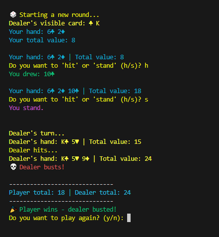
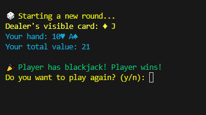

# 🃏 Python Blackjack Game

A simple command-line Blackjack game built in Python.  
This was developed as a follow-up to my "Draw a Card" program —  
expanding it into a full playable Blackjack simulation!

## 🎯 Features
- Full playable Blackjack logic (Hit, Stand, Blackjack check, dealer AI)
- Clean console UI with emoji feedback
- Replay option
- Beginner-friendly, modular Python code

## ▶️ How to Play
1. Clone the repo:
   ```bash
   git clone https://github.com/xy-0-lita/Blackjack_Game.git
   cd Blackjack_Game

2. (Opt) Creating Virtuall Environment
   python -m venv .venv
   source .venv/bin/activate   # macOS/Linux
   .venv\Scripts\activate      # Windows
  
4. Run the game:
   python blackjack_game.py
   
## 🧭 Learning Objectives
  - Writing modular, reusable code
  - Understanding tuples, lists, & loops
  - Building & shuffling card deck
  - Managing control flow w/ if, elif, else & while loops
  - Using time, os, and colorama modules for better game flow & presentation

## 🌱 Future Improvements
  - Adding a betting system with chips
  - Add multiplayer opt.
  - Tracking win/loss statistics over multiple sessions
  - Card-counting hints
  - Creating a GUI version w/ tkinter or pygame

## 📸 Gameplay Screenshots
   Here's a brief look at the game in action:
  - Opening Screen
   
  - Gameplay Round
    
  - Blackjack Win
   
